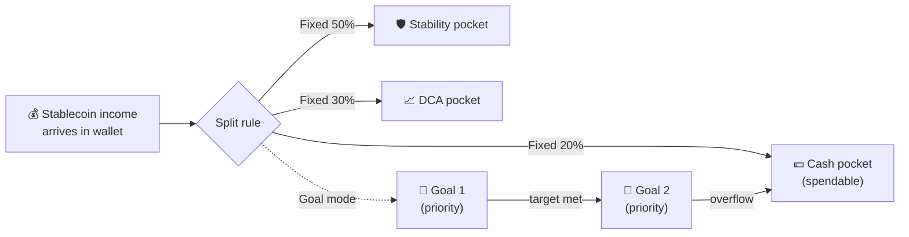
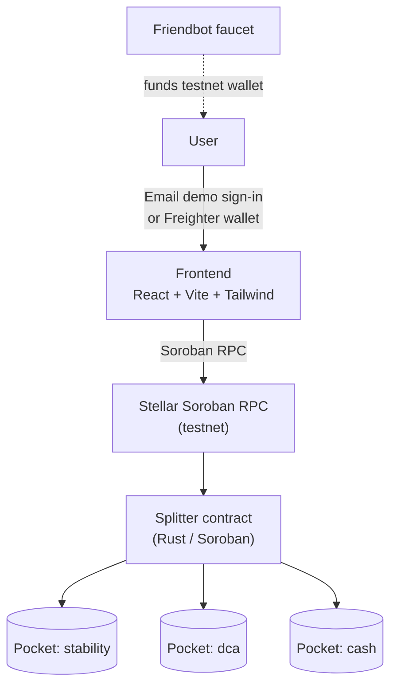
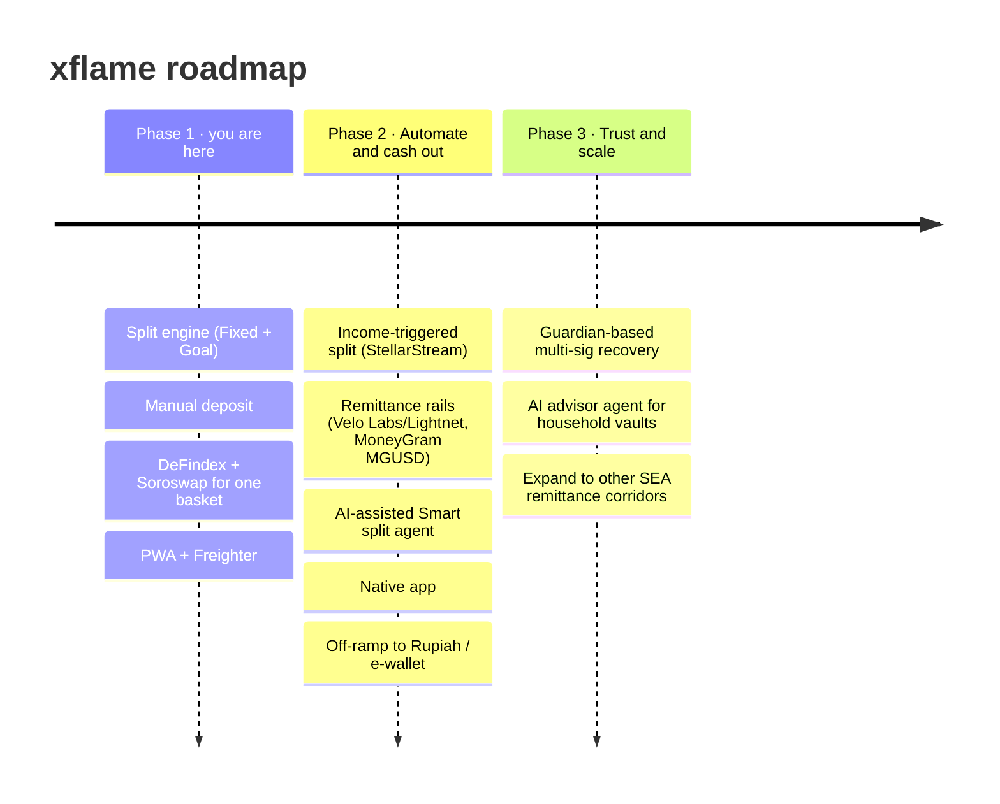

<div align="center">
  

  # xflame

  [](https://github.com/artomily/xflame/actions/workflows/ci.yml)

  **The moment stablecoin income lands, it's auto-split into a stability vault, a DCA basket, and spendable cash — instead of sitting idle even a minute.**

  Built on Stellar / Soroban. React + Tailwind frontend, fronted by *Ame* the blue flame.

  **[Live demo →](https://xflame.vercel.app)**  ·  **[Pitch deck →](xflame-pitch-deck.pptx)**

  <a href="https://youtu.be/kdpUCG3ZmGs">
    
  </a>

  <sub>▶ Watch the demo video</sub>
</div>

---

## The problem

Millions of families in Indonesia and SEA receive remittances from relatives working abroad. Getting paid in stablecoins instead of through a bank is already a huge upgrade — it lands in seconds and fees are near zero.

But that's where it stops. The moment the money arrives, it just **sits idle** in a wallet:

- No savings discipline, no investing, no budget — just a balance that doesn't move.
- Traditional auto-invest apps (Bibit, Acorns, …) are custodial and can't touch stablecoin income that never enters a bank.
- Managing it manually (moving % to savings, % to DCA, % to spend) is tedious enough that most people just... don't.

**The hard part was never receiving the money. It's what happens the second after it lands — and right now, nobody's managing that.**

## The solution

**xflame** is an auto-split vault. You define a split rule once; every time funds arrive they're divided across named "pockets" automatically, on-chain:

- **Fixed split** — static percentages, e.g. 50% stability / 30% DCA / 20% cash.
- **Goal-based split** — priority-ordered goals (dana darurat → DP motor → …); each deposit tops up goals in order until the target is met, and anything left over lands in a spendable overflow pocket.

Near-zero Stellar fees make splitting on *every* deposit economical, and composing with audited Stellar infra (DeFindex, Soroswap) avoids bootstrapping DeFi trust from scratch.

> **Status: Phase 1 MVP** — single-player split engine with Fixed + Goal rules and manual deposit. See the [roadmap](#roadmap).

### How it works



1. **Set a rule once** — Fixed percentages or priority-ordered Goals.
2. **Income lands** — stablecoin arrives from family abroad, no bank or custodian in the middle.
3. **It auto-splits** — every deposit divides across pockets on-chain, instantly.

### Architecture



## Deployed on testnet

| | |
|---|---|
| Splitter contract | [`CDN26FLI5JYVWKPB64E46WABV2W4BAPJW2JLDADNVAK6F7N5IZY7HVZI`](https://stellar.expert/explorer/testnet/contract/CDN26FLI5JYVWKPB64E46WABV2W4BAPJW2JLDADNVAK6F7N5IZY7HVZI) |
| Deposit token (native XLM SAC) | [`CDLZFC3SYJYDZT7K67VZ75HPJVIEUVNIXF47ZG2FB2RMQQVU2HHGCYSC`](https://stellar.expert/explorer/testnet/contract/CDLZFC3SYJYDZT7K67VZ75HPJVIEUVNIXF47ZG2FB2RMQQVU2HHGCYSC) |
| `set_rule` tx (Fixed 50/30/20) | [`9bf2452c193591b36f0d1b5c0b379cd2353b6c1bd38c75519ec5a26e96c077df`](https://stellar.expert/explorer/testnet/tx/9bf2452c193591b36f0d1b5c0b379cd2353b6c1bd38c75519ec5a26e96c077df) |
| `deposit` tx (100 XLM → split) | [`0df60589537d65ed69fa755508c99b8125af39c94c5e7196a998f37efb72a390`](https://stellar.expert/explorer/testnet/tx/0df60589537d65ed69fa755508c99b8125af39c94c5e7196a998f37efb72a390) |

Verified on-chain: depositing 100 XLM against the Fixed 50/30/20 rule above produced pockets of exactly `stability: 500000000`, `dca: 300000000`, `cash: 200000000` stroops.

## User onboarding & feedback

**Status:** 1 real tester onboarded via the live feedback form so far — actively recruiting more toward the 10+ minimum. Full onboarding log and verification methodology: [USER_FEEDBACK.md](USER_FEEDBACK.md).

- **Try it & give feedback:** [Google Form](https://docs.google.com/forms/d/e/1FAIpQLSc2FAJLJJ4v8vfw_oEIeyJlc52wD3QvtKq0Q_Gkn6egfb_RBQ/viewform)
- **Raw responses (live):** [Google Sheet](https://docs.google.com/spreadsheets/d/1Cdb4WKMacN9OuHMsRmupGzkDJZyV-BZ9sLE5zwJjt5E/edit?usp=sharing) (public, view-only)
- **Exported snapshot (public, Excel):** [docs/feedback-responses.xlsx](docs/feedback-responses.xlsx) — re-export any time with:
  ```bash
  curl -L -o docs/feedback-responses.xlsx "https://docs.google.com/spreadsheets/d/1Cdb4WKMacN9OuHMsRmupGzkDJZyV-BZ9sLE5zwJjt5E/export?format=xlsx"
  ```

### Users Onboarded

| User ID | Name | Email | Wallet Address | Feedback Summary |
|---|---|---|---|---|
| 01 | Ahmad Juan | _(not provided)_ | `GDLY...NNQJ` | Signed in / created a session. Rated overall 4/5, first-rule clarity 5/5. Would "definitely" use it for family remittance income. No friction or feature request submitted. |
| 02 | Aditya Pratama | _(not provided)_ | `GBUZ...DEHR` | Signed in, created a split rule. Rated 5/5 and 5/5. "Nothing was particularly confusing. The flow was straightforward." Requested recurring split rules. |
| 03 | Salsabila Putri | salsabila01@gmail.com | `GDQQ...RBVU` | Signed in / created a session. Rated 4/5 and 4/5. **"I wasn't immediately sure what a pocket represented."** Requested better first-time onboarding. |
| 04 | Fajar Ramadhan | fajarrre@gmail.com | `GCMM...FSBT` | Signed in, created a split rule. Rated 5/5 and 5/5. "The process was clear and I didn't get stuck anywhere." Requested transaction history. |
| 05 | Arjun Sharma | shararjun11@gmail.com | `GAER...3BXF` | Explored without completing the flow. Rated 4/5, clarity 3/5. **"I wasn't completely sure how the split rule would work before actually creating one."** Requested a tutorial or demo mode. Only respondent who would not use the app. |
| 06 | Rizky Maulana | _(not provided)_ | `GC54...TVDC` | Signed in, withdrew from a pocket. Rated 5/5 and 5/5. "The withdrawal flow was easy to follow." Requested withdrawal notifications. |
| 07 | Dinda Maharani | mhrdinda23@gmail.com | `GDRS...3DOR` | Signed in / created a session. Rated 3/5, clarity 3/5 — lowest overall score. **"It took me a moment to understand the relationship between pockets and split rules."** Requested clearer explanations of pockets. |
| 08 | Bagas Saputra | _(not provided)_ | `GDJG...JRSS` | Signed in, created a split rule, withdrew from a pocket. Rated 4/5 and 4/5. **"The terminology was slightly confusing at first, but I figured it out."** |
| 09 | Ayu Lestari | _(not provided)_ | `GAJT...VU45` | Signed in, created a split rule. Rated 5/5 and 5/5. "No major confusion during the flow." Requested a mobile app. |
| 10 | Yoga Pranata | _(not provided)_ | `GDBA...55A5` | Explored without completing the flow. Rated 4/5, clarity 3/5. **"I wanted more context about what happens after creating a rule."** Requested more detailed rule previews. |
| 11 | Intan Permata | _(not provided)_ | `GAUN...ND7I` | Signed in, created a split rule. Rated 5/5 and 5/5. Requested scheduled payments. |
| 12 | Karman Singh Chandhok | chandhokkarmansingh@gmail.com | `GAVB...CH6N` | Signed in / created a session. Rated 4/5, first-rule clarity 5/5. Would "definitely" use it for family remittance income. No friction or feature request submitted. |

**12 form responses** collected between 2026-07-16 and 2026-08-27 via the [in-app feedback form](https://docs.google.com/forms/d/e/1FAIpQLSc2FAJLJJ4v8vfw_oEIeyJlc52wD3QvtKq0Q_Gkn6egfb_RBQ/viewform). Full per-response detail and aggregate scores: [USER_FEEDBACK.md](USER_FEEDBACK.md).

### Feedback Implementation

| User ID | Name | Wallet Address | Feedback Summary | Improvement Made | Git Commit ID |
|---|---|---|---|---|---|
| 03 | Salsabila Putri | `GDQQ...RBVU` | "I wasn't immediately sure what a pocket represented." | Defined "pocket" where it first appears — a callout in the onboarding modal and a mode-aware explainer line at the top of the rule builder | [`8210381`](https://github.com/artomily/xflame/commit/8210381) |
| 07 | Dinda Maharani | `GDRS...3DOR` | "It took me a moment to understand the relationship between pockets and split rules." | Same fix — the explainer states the pocket↔rule relationship directly instead of leaving it to be inferred | [`8210381`](https://github.com/artomily/xflame/commit/8210381) |
| 08 | Bagas Saputra | `GDJG...JRSS` | "The terminology was slightly confusing at first, but I figured it out." | Same fix — terminology is now defined in-product rather than worked out from the inputs | [`8210381`](https://github.com/artomily/xflame/commit/8210381) |
| 05 | Arjun Sharma | `GAER...3BXF` | "I wasn't completely sure how the split rule would work before actually creating one." | Live split preview moved into the rule builder — a 100 XLM sample breakdown renders as soon as the rule is valid, before saving | [`8a071a3`](https://github.com/artomily/xflame/commit/8a071a3) |
| 10 | Yoga Pranata | `GDBA...55A5` | "I wanted more context about what happens after creating a rule." | Same fix — plus explicit "Preview only — nothing is saved or sent until you save the rule" copy | [`8a071a3`](https://github.com/artomily/xflame/commit/8a071a3) |

### Improvement Summary

Two problems accounted for five of the eleven responses, and they were the
two that cost us completions:

**1. "Pocket" was never defined (3 responses — #03, #07, #08).** The word
carried the whole mental model of the product but appeared only as an input
placeholder. [`8210381`](https://github.com/artomily/xflame/commit/8210381)
defines it in the onboarding modal and again at the top of the rule builder,
with the wording switching between Fixed and Goal mode so it describes the
rule the user is actually building.

**2. Nothing showed what a rule would do until after it was saved (2 responses
— #05, #10).** A live preview existed, but only inside the deposit card, which
is gated behind having saved a rule — so the people who needed it most never
reached it. Both respondents who abandoned the flow named this, and neither
completed it.
[`8a071a3`](https://github.com/artomily/xflame/commit/8a071a3) renders the same
breakdown against a 100 XLM sample directly in the rule builder, as soon as the
rule is valid.

The signal was consistent: the three lowest clarity scores (3/5) belong to #05,
#07, and #10 — exactly the people who raised these two issues — and the only
respondent who said they would not use the app (#05) is also the only one who
never got past the rule builder.

Earlier work that set this up:

- [`fa4394a`](https://github.com/artomily/xflame/commit/fa4394a) — wired up Vercel Analytics and the in-app feedback link, so real usage and friction could be measured at all.
- [`b1208ad`](https://github.com/artomily/xflame/commit/b1208ad) — fixed the feedback link, which had been pointing at a placeholder (`forms.gle/REPLACE_ME`).
- [`385804e`](https://github.com/artomily/xflame/commit/385804e) — added the first-run onboarding modal and in-dashboard checklist that the fixes above build on.

### Screenshots


### Analytics & monitoring

[Vercel Analytics](https://vercel.com/docs/analytics) and [Speed Insights](https://vercel.com/docs/speed-insights) are wired into the frontend (`frontend/src/main.tsx`) and tracking the live deployment:


---

Also see [BUSINESS.md](BUSINESS.md) for the monetization/business model behind xflame.

## Project structure

```
xflame/
├── frontend/                    # React + TypeScript + Vite + Tailwind v4
│   ├── src/
│   │   ├── App.tsx              # Shell — Vault / Faucet / Send tabs
│   │   ├── Split.tsx            # Auto-split vault: rule builder, deposit, pockets
│   │   ├── Faucet.tsx           # Testnet XLM faucet (Friendbot)
│   │   ├── Send.tsx             # Plain XLM transfer
│   │   └── stellar.ts           # Freighter wallet + Soroban contract client
│   └── bindings-splitter/       # Auto-generated splitter TypeScript client
└── contract/                    # Soroban smart contracts (Rust)
    └── contracts/
        ├── splitter/            # ⭐ Auto-split vault (the product)
        └── vault/               # Generic single-token vault primitive
```

## Prerequisites

- [Node.js](https://nodejs.org) 18+
- [Rust](https://www.rust-lang.org/tools/install) + `wasm32v1-none` target
- [Stellar CLI](https://developers.stellar.org/docs/tools/stellar-cli) 27+
- [Freighter wallet](https://www.freighter.app) browser extension (set to Testnet)

```bash
rustup target add wasm32v1-none
stellar --version
```

## Run the frontend

```bash
cd frontend
npm install
cp .env.example .env      # fill in VITE_SPLITTER_CONTRACT_ID after deploying
npm run dev               # http://localhost:5173
```

Without a deployed contract the Vault runs in **preview mode**: you can design a split rule and see the live split preview, but on-chain actions (save rule / deposit / withdraw) are disabled until `VITE_SPLITTER_CONTRACT_ID` is set.

### Environment variables

```env
VITE_STELLAR_NETWORK_PASSPHRASE="Test SDF Network ; September 2015"
VITE_STELLAR_RPC_URL=https://soroban-testnet.stellar.org
VITE_SPLITTER_CONTRACT_ID=      # deployed splitter contract ID
VITE_XLM_TOKEN_ID=              # native XLM asset contract (deposit token)
```

## Features

- **Vault** — the auto-split vault. Pick Fixed or Goal mode, build your rule, and watch a live preview of how any deposit divides across pockets. Deposit splits on-chain; withdraw per pocket; goal pockets show progress toward their target.
- **Faucet** — fund any Stellar testnet address with 10,000 XLM in one click (calls Friendbot directly — no contract needed). Handy for funding a wallet before a demo.
- **Send** — plain XLM transfer to any testnet address.

## The splitter contract

```rust
// Bind the vault to the single stablecoin it accepts (constructor)
__constructor(token: Address)

// Configure how deposits are divided
set_rule(user: Address, rule: SplitRule)

// Deposit `amount` stroops and split across pockets per the rule
deposit(user: Address, amount: i128)

// Withdraw from a specific pocket
withdraw(user: Address, pocket: Symbol, amount: i128)

// Views
pockets(user: Address) -> Map<Symbol, i128>
pocket_balance(user: Address, pocket: Symbol) -> i128
rule(user: Address) -> Option<SplitRule>

pub enum SplitRule {
    Fixed(Vec<Allocation>),          // bps must sum to 10_000
    Goal(Vec<Goal>, Symbol),         // ordered goals + overflow pocket
}
```

Balances are always preserved: the sum credited across pockets equals the deposit (the last Fixed pocket soaks any rounding remainder). For the MVP every pocket holds the same stablecoin — later phases route the stability pocket into a DeFindex vault and swap the DCA pocket via Soroswap behind the same surface.

```bash
cd contract
cargo test               # 11 tests
stellar contract build   # wasm → target/wasm32v1-none/release/splitter.wasm
```

### Deploy to testnet

```bash
# 1. Create + fund a deployer
stellar keys generate --global deployer --network testnet
stellar keys fund deployer --network testnet

# 2. Deposit token = native XLM asset contract
XLM=$(stellar contract id asset --asset native --network testnet)

# 3. Deploy (constructor takes the token address)
stellar contract deploy \
  --network testnet --source deployer \
  --wasm contract/target/wasm32v1-none/release/splitter.wasm \
  -- --token "$XLM"

# 4. Put the printed contract ID + $XLM into frontend/.env
#    VITE_SPLITTER_CONTRACT_ID=C...
#    VITE_XLM_TOKEN_ID=C...
```

TypeScript bindings are already generated in `frontend/bindings-splitter/`. Regenerate them any time with:

```bash
stellar contract bindings typescript \
  --wasm contract/target/wasm32v1-none/release/splitter.wasm \
  --output-dir frontend/bindings-splitter --overwrite
```

## Roadmap



1. **Validate & MVP (single-player)** ← *you are here* — split engine (Fixed + Goal), manual deposit, DeFindex + Soroswap for one basket, PWA + Freighter.
2. **Automate & cash out** — income-triggered split the moment funds land via streaming (StellarStream) and remittance rails (Velo Labs/Lightnet, MoneyGram MGUSD); an AI-assisted Smart split agent handles rebalance/timing; native app; off-ramp to Rupiah / e-wallet — closing the loop from income to spendable cash.
3. **Trust & scale** — guardian-based multi-sig recovery for non-crypto-native users; an AI advisor agent for shared household vaults; expand to other SEA remittance corridors.

## Links

- [Soroban docs](https://developers.stellar.org/docs/build/smart-contracts/overview)
- [Stellar testnet explorer](https://stellar.expert/explorer/testnet)
- [Friendbot](https://friendbot.stellar.org) — testnet XLM faucet
- [Freighter wallet](https://www.freighter.app)
