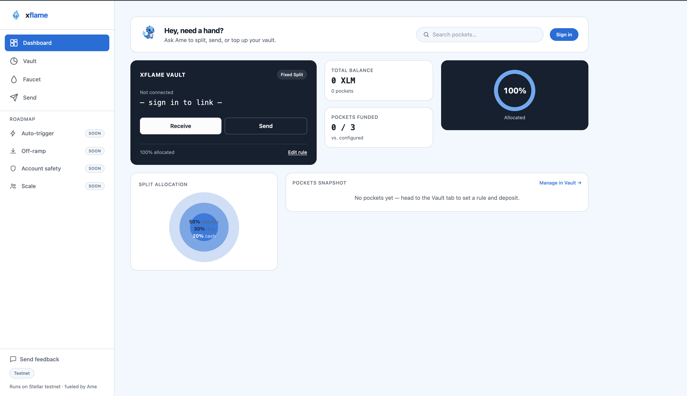
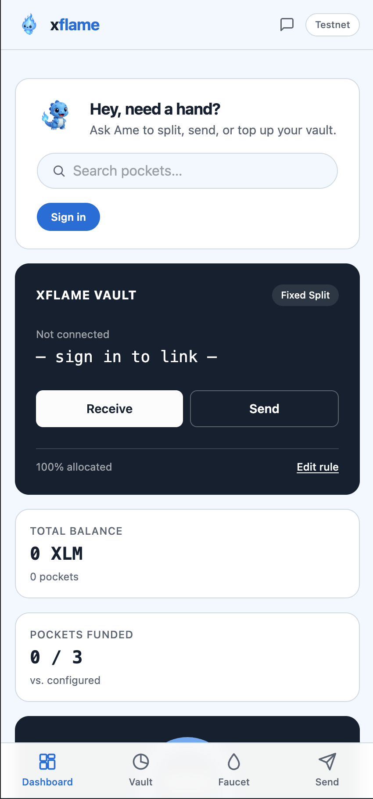
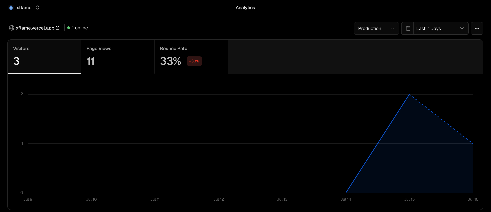

# xflame — User Onboarding & Feedback

Proof of real users, wallet interactions, and feedback collected via the in-app
[feedback form](frontend/src/config.ts).

---

## How to fill this in

1. Share the live demo ([xflame.vercel.app](https://xflame.vercel.app)) with real people and ask them to sign in, set a split rule, and deposit testnet XLM.
2. Every submission to the feedback form includes a wallet address — cross-check it on [stellar.expert testnet explorer](https://stellar.expert/explorer/testnet) to confirm an on-chain `set_rule` or `deposit` transaction from that address.
3. Fill in the table below with real rows only. Do not invent entries — reviewers check the wallet addresses against the explorer.
4. Update the summary stats and quotes from actual form responses once you have 10+.

---

## Wallet interactions (proof of onboarding)

Raw form responses (name, email, wallet, ratings, feedback): [xflame feedback — Google Sheet](https://docs.google.com/spreadsheets/d/1Cdb4WKMacN9OuHMsRmupGzkDJZyV-BZ9sLE5zwJjt5E/edit?usp=sharing)

| # | Wallet address (truncated) | Action taken | Tx link |
|---|---|---|---|
| 1 | `GXXX...XXXX` | Set rule + deposit | [view on stellar.expert](https://stellar.expert/explorer/testnet) |
| 2 | | | |
| 3 | | | |
| 4 | | | |
| 5 | | | |
| 6 | | | |
| 7 | | | |
| 8 | | | |
| 9 | | | |
| 10 | | | |

**Total unique wallets onboarded:** `0` / 10 minimum — form is live but has 0 responses so far. Share the demo + form link with real users, then re-run this table from the sheet above.

---

## Feedback summary

_Aggregate from `0` form responses collected so far — sheet linked above is live but empty. Fill this in once responses come in._

| Metric | Result |
|---|---|
| Avg. clarity of first split rule setup (1–5) | `[X.X]` |
| % who said they'd actually use it for remittance income | `[XX]%` |
| Most common friction point | `[e.g. "unclear what a pocket is"]` |
| Most requested feature | `[e.g. "auto-split on arrival, not manual deposit"]` |

### What went well
- `[quote or theme from responses]`
- `[quote or theme from responses]`

### What needs to improve
- `[quote or theme from responses]`
- `[quote or theme from responses]`

### Representative quotes

> "`[verbatim quote from a respondent]`"
> — Respondent `#[N]`

> "`[verbatim quote from a respondent]`"
> — Respondent `#[N]`

---

## Screenshots

- [x] Product UI (desktop) — [docs/screenshots/dashboard.png](docs/screenshots/dashboard.png)
- [x] Mobile responsive view — [docs/screenshots/mobile.png](docs/screenshots/mobile.png)
- [x] Vercel Analytics dashboard — [docs/screenshots/analytics-1.png](docs/screenshots/analytics-1.png)

---

See [README.md](README.md) for product/architecture docs and the deployed contract address.
