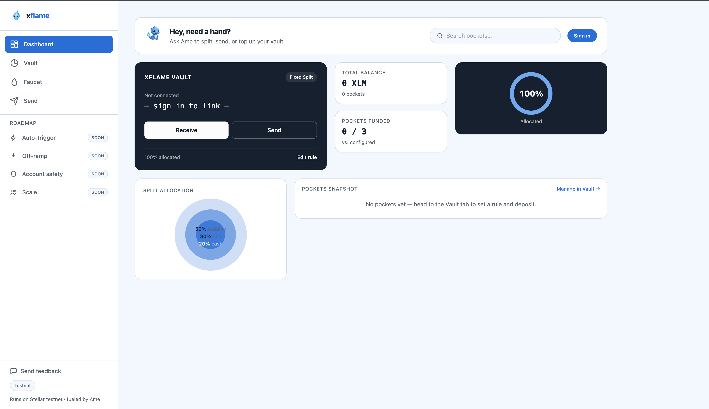
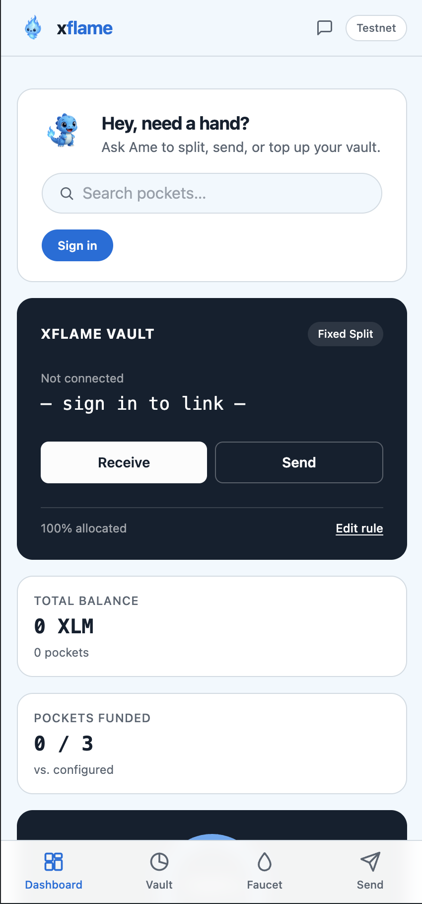
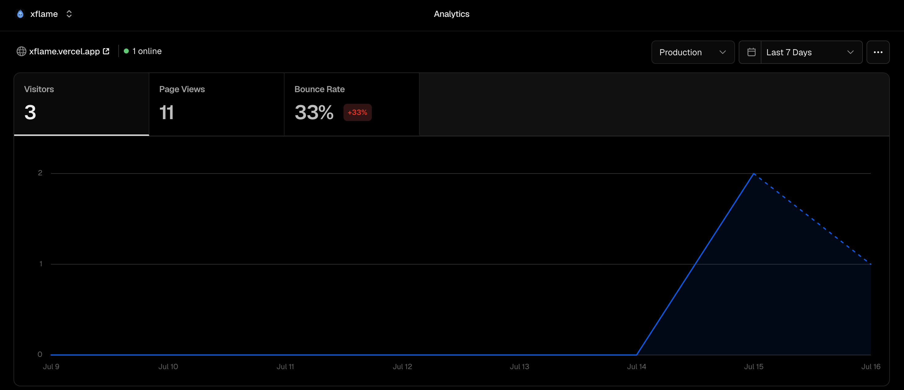

# xflame — User Onboarding & Feedback

Proof of real users, wallet interactions, and feedback collected via the in-app
[feedback form](frontend/src/config.ts).

---

## How to fill this in

1. Share the live demo ([xflame.vercel.app](https://xflame.vercel.app)) with real people and ask them to sign in, set a split rule, and deposit testnet XLM.
2. Every submission to the feedback form includes a wallet address — cross-check it on [stellar.expert testnet explorer](https://stellar.expert/explorer/testnet) to confirm an on-chain `set_rule` or `deposit` transaction from that address.
3. Fill in the table below with real rows only. Do not invent entries — reviewers check the wallet addresses against the explorer.
4. Update the summary stats and quotes from actual form responses once you have 10+.

---

## Wallet interactions (proof of onboarding)

Raw form responses (name, email, wallet, ratings, feedback): [xflame feedback — Google Sheet](https://docs.google.com/spreadsheets/d/1Cdb4WKMacN9OuHMsRmupGzkDJZyV-BZ9sLE5zwJjt5E/edit?usp=sharing)

| # | Wallet address (truncated) | Action taken | Tx link |
|---|---|---|---|
| 1 | `GDLY...NNQJ` | Signed in / funded testnet wallet only — no `set_rule` or `deposit` tx yet | [view on stellar.expert](https://stellar.expert/explorer/testnet/account/GDLYI4DUXPTQVKIBME7LCUDJUGXUFYYPK5PICFHDX35TDUPSPXSONNQJ) |
| 2 | | | |
| 3 | | | |
| 4 | | | |
| 5 | | | |
| 6 | | | |
| 7 | | | |
| 8 | | | |
| 9 | | | |
| 10 | | | |

**Total unique wallets onboarded:** `1` / 10 minimum — form is live with 1 real response (name: Ahmad Juan), but that wallet has only been funded and signed in, not yet exercised `set_rule`/`deposit` against the splitter contract. Share the demo + form link with real users, then re-run this table from the sheet above. See the [Users Onboarded / Feedback Implementation tables in README.md](README.md#user-onboarding--feedback) for the full per-user record.

---

## Feedback summary

_Aggregate from `1` form response collected so far (n=1 — directional only, not statistically meaningful; will be rewritten as a real aggregate once 10+ responses are in)._

| Metric | Result |
|---|---|
| Avg. clarity of first split rule setup (1–5) | `5.0` (n=1) |
| Avg. overall product rating (1–5) | `4.0` (n=1) |
| % who said they'd actually use it for remittance income | `100%` (1/1) |
| Most common friction point | _none reported yet_ |
| Most requested feature | _none reported yet_ |

### What went well
- First-run split-rule setup rated 5/5 for clarity by respondent #1.
- Respondent #1 said they'd "definitely" use xflame if it were available for receiving remittance income from family/friends.

### What needs to improve
- _Nothing specific reported yet — respondent #1 left the "most confusing part" and "feature request" questions blank._
- Respondent #1 only signed in and funded a testnet wallet; didn't get as far as `set_rule`/`deposit`, so we don't yet have feedback on the actual split-vault flow from a real user.

### Representative quotes

_None yet — respondent #1 didn't leave free-text answers. Will add real verbatim quotes here once more responses include them._

---

## Screenshots

- [x] Product UI (desktop) — [docs/screenshots/dashboard.png](docs/screenshots/dashboard.png)
- [x] Mobile responsive view — [docs/screenshots/mobile.png](docs/screenshots/mobile.png)
- [x] Vercel Analytics dashboard — [docs/screenshots/analytics-1.png](docs/screenshots/analytics-1.png)

---

See [README.md](README.md) for product/architecture docs and the deployed contract address.
