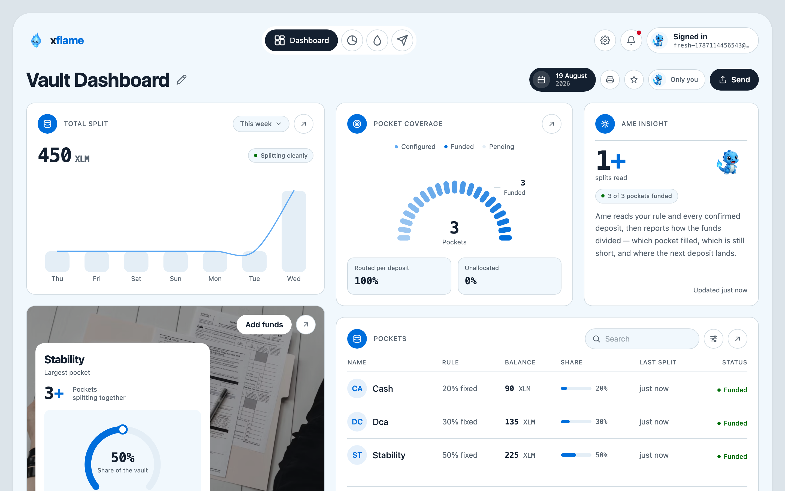
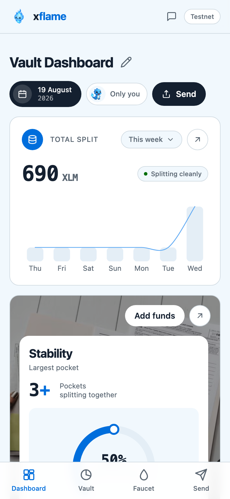
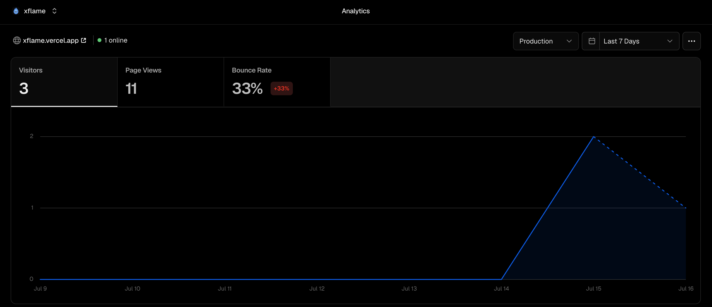

# xflame — User Onboarding & Feedback

the live demo at
[xflame.vercel.app](https://xflame.vercel.app).

---

## Form responses

Raw responses (name, email, wallet, ratings, feedback): [xflame feedback — Google Sheet](https://docs.google.com/spreadsheets/d/1Cdb4WKMacN9OuHMsRmupGzkDJZyV-BZ9sLE5zwJjt5E/edit?usp=sharing)

**11 form responses**, submitted between 2026-07-16 and 2026-08-23.

| # | Name | Wallet (truncated) | Action taken (self-reported) |
|---|---|---|---|
| 1 | Ahmad Juan | `GDLY...NNQJ` | Signed in / created a session |
| 2 | Aditya Pratama | `GBUZ...DEHR` | Signed in, created a split rule |
| 3 | Salsabila Putri | `GDQQ...RBVU` | Signed in / created a session |
| 4 | Fajar Ramadhan | `GCMM...FSBT` | Signed in, created a split rule |
| 5 | Arjun Sharma | `GAER...3BXF` | Explored only, did not complete flow |
| 6 | Rizky Maulana | `GC54...TVDC` | Signed in, withdrew from a pocket |
| 7 | Dinda Maharani | `GDRS...3DOR` | Signed in / created a session |
| 8 | Bagas Saputra | `GDJG...JRSS` | Signed in, created a split rule, withdrew |
| 9 | Ayu Lestari | `GAJT...VU45` | Signed in, created a split rule |
| 10 | Yoga Pranata | `GDBA...55A5` | Explored only, did not complete flow |
| 11 | Intan Permata | `GAUN...ND7I` | Signed in, created a split rule |

## Feedback summary

_Aggregate from all 11 form responses._

| Metric | Result |
|---|---|
| Avg. clarity of first split rule setup (1–5) | `4.3` (n=11) |
| Avg. overall product rating (1–5) | `4.4` (n=11) |
| % who said they'd actually use it for remittance income | `91%` (10/11) |
| Most common friction point | Pocket vs. split-rule relationship unclear (3/11) |
| Most requested feature | Onboarding/tutorial improvements (3/11) |
| Agreed to follow-up contact | `8` yes, `2` no, `1` blank |

### What went well

- Overall rating averages 4.4/5, with five perfect scores.
- 10 of 11 said they'd "definitely" use xflame for receiving money from family or friends.
- Four respondents reported no confusion at all: _"The flow was straightforward"_,
  _"clear and I didn't get stuck anywhere"_, _"The withdrawal flow was easy to follow"_.

### What needs to improve

1. **Pockets aren't self-explanatory (3/11 — the single biggest issue).**
   - _"I wasn't immediately sure what a pocket represented."_ — Salsabila Putri
   - _"It took me a moment to understand the relationship between pockets and split rules."_ — Dinda Maharani
   - _"The terminology was slightly confusing at first, but I figured it out."_ — Bagas Saputra
2. **No preview of what a rule will actually do (2/11).** Both respondents who bailed
   before completing the flow named this.
   - _"I wasn't completely sure how the split rule would work before actually creating one."_ — Arjun Sharma
   - _"I wanted more context about what happens after creating a rule."_ — Yoga Pranata
3. **Ratings cluster low exactly where confusion is high.** The three lowest ease scores
   (3, 3, 3) belong to Arjun, Yoga, and Dinda — the same people who flagged #1 and #2.
   The only respondent who said they would *not* use the app (Arjun) is also the one who
   never completed the flow.

### Shipped in response

| Issue reported | Fix | Commit |
|---|---|---|
| "Pocket" never defined (3 responses) | Defined in the onboarding modal and at the top of the rule builder, worded per mode | [`8210381`](https://github.com/artomily/xflame/commit/8210381) |
| No preview of a rule's effect before saving (2 responses) | 100 XLM sample breakdown rendered in the rule builder as soon as the rule is valid | [`8a071a3`](https://github.com/artomily/xflame/commit/8a071a3) |

See the [Feedback Implementation table in README.md](README.md#feedback-implementation)
for the per-user mapping.

### Feature requests

| Request | Count |
|---|---|
| Onboarding / tutorial / demo mode / clearer pocket explanations | 3 |
| Recurring or scheduled split rules | 2 |
| Transaction history | 1 |
| Withdrawal notifications | 1 |
| Mobile app | 1 |
| More detailed rule previews | 1 |

---

## Screenshots

- [x] Product UI (desktop) — [docs/screenshots/dashboard.png](docs/screenshots/dashboard.png)
- [x] Mobile responsive view — [docs/screenshots/mobile.png](docs/screenshots/mobile.png)
- [x] Vercel Analytics dashboard — [docs/screenshots/analytics-1.png](docs/screenshots/analytics-1.png)

---

See [README.md](README.md) for product/architecture docs and the deployed contract address.
